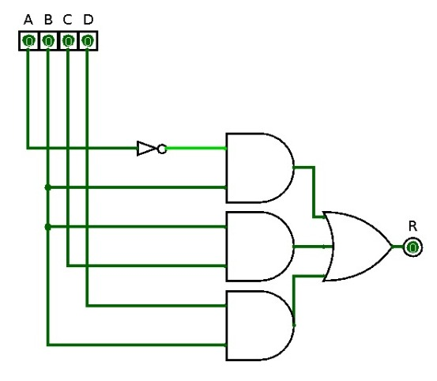
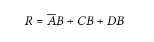
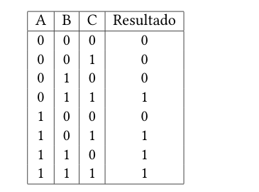
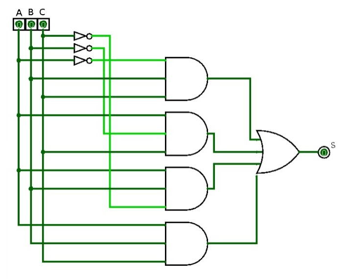

# Circuitos combinacionais

Ao combinar as portas lógicas que vimos até aqui, podemos criar muitos tipos diferentes de circuitos que nos ajudam a resolver muitos problemas. Esses circuitos tem a seguinte característica, a saída do circuito em um determinado momento, depende apenas das entradas nesses mesmo momento. Ou seja, esses circuitos não dependem de entradas/saidas que foram obtidas no passado, nem de algum tipo de memória. Esses circuitos são conhecidos como circuitos combinacionais. Isto porque a saída depende apenas das combinações das entradas em um determinado instante.

Veremos nesse capítulo como criar circuitos combinacionais que resolvam algum problema real.

## Projetando Circuitos Lógicos Combinacionais

Existem diversas técninas para projetar um circuito combinacional para resolver um problema específico, algumas técnicas são simples e podemos fazer manualmente, algumas outras são feitas com a ajuda de programas de computador. Algumas possuem princípios básicos necessários para fazer a análise e criação do circuito.

Um dos principíos básicos, é a criação de uma tabela verdade que descreva o resultado do nosso circuito, com isso podemos pensar combinações de portas lógicas que satisfaçam essa tabela. 

Além disso, existe um padrão de circuitos que eventualmente aparece enquanto estamos projetando o nosso circuito, esse padrão é conhecido como "Soma-de-Produtos", veremos esse padrão a seguir, e depois, veremos como projetar um circuito que esteja utilizando esse padrão.

### Soma-de-Produtos

Um circuito está na forma de soma-de-produtos quando todas as entradas do circuito estão conectadas a portas `AND` e o resultado dessas portas estão conectadas em uma porta `OR`, essa porta `OR` pode ter diversas entradas, dependendo apenas da quantidade de portas `AND` que irão se conectar a esse `OR`. Além disso, as entradas do circuito podem ou não estar conectadas a um inversor. Veja um exemplo de circuito que está no formato soma-de-produtos:

Neste circuito, perceba que todas as saidas dos `AND` estão conectados ao `OR` e todas as entrdas então conectadas ao `AND`, e que também é possivel que uma entrada esteja invertida, como é o caso da entrada `A`. Veja como seria a representação algébrica desse circuito:

Nesse caso,`R` representa a saída do circuito. Perceba que a representação algébrica do circuito é uma soma de produtos, por esse motivo que esse formato possue o nome de soma-de-produtos

### Exemplo de circuito utilizando a soma de produtos

Agora com as ideias básicas, veremos como criar um circuito que resolva algum problema, iremos descrever o problema e resolve-lo para que o leitor entenda os passos básicos para a resolução de qualquer problema semelhante.

Descrição do problema: 

> Queremos implementar uma circuito básico que é utilizado ao criar um circuito que faz somas. Nesse circuito básico desejamos que a saida esteja ativa quando ao menos duas das suas três entradas estejam ativas.

Dado o problema, o primeiro passo é descrever uma tabela verdade que represente o comportamento que queremos, essa tabela é descrita da seguinte forma:

Agora precisamos verificar cada linha que tenha a saida ativa, e montar uma expressao `AND` com as entradas daquela linha. Veja como montar essa expressão para cada linha da tabela verdade:

Esse expressão `AND` é montada conectadando todas as entradas daquela determinada linha a uma porta `AND` e verificando quais entradas tem o valor 0, então, essas entradas precisar ser conectadas a um inversor antes de serem conectadas a uma porta `AND`, assim todas as entradas daquela linha terão o estado ativo depois de conectadas a um inversor. 

Após montar essas três expressões `AND` iremos conectar todos elas a uma porta `OR`, formando um circuito de soma-de-produtos. Com isso, temos o circuito finalizado. Veja a representação final na forma de expressão algébrica e na forma de circuito:

# Circuito para travar porta em minecraft

