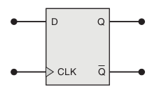
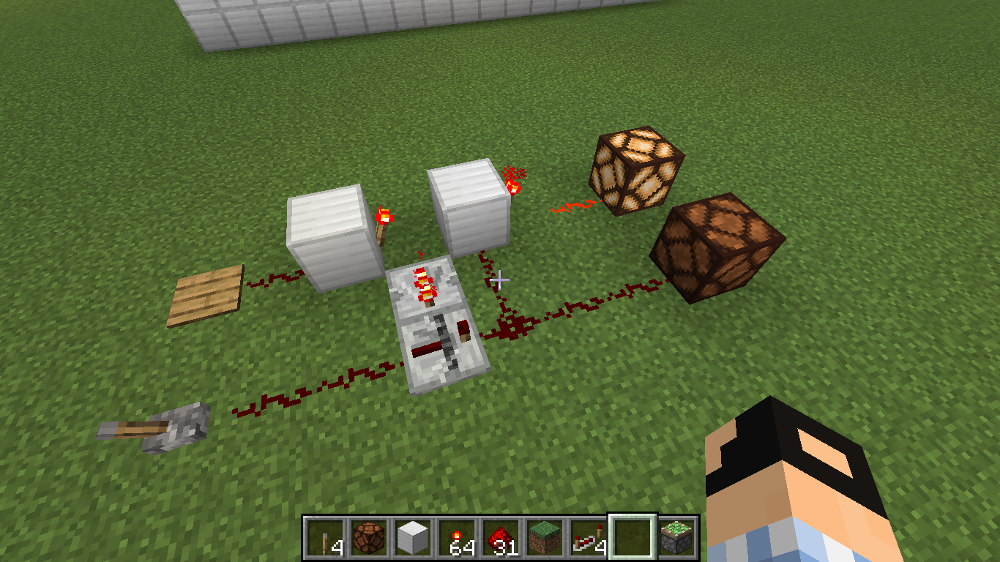

# Circuitos com memória

Alguns problemas da vida real não podem ser implementados apenas usando circuitos combinacionais. Como por exemplo, em situações onde precisamos armazenar algum tipo de informação, esses são circuitos precisam de técnicas para implementar algum tipo de memória.

Alguns dos disposítivos mais usados para implementar memória são os dispositivos conhecidos como Flip-Flops, veremos nesse capítulo a forma como esses dispositivos funcionam e um exemplo de sua utilidade.

## Pulsos

Para conhecer mais sobre esses dispositivos, é importante conhecer um conceito muito utilizado em dispositivos de Flip-Flop e também em outros circuitos. Esse conceito é o "Pulso Digital", que também é chamado de Clock. 

Em circuitos digitais o Clock é definido como uma entrada que é ativada e desativada rapidamente, formando um pulso. Essa entrada que produz pulsos é muito útil, sua utilização é a seguinte: Ela é conectada a um circuito, nesse circuito, suas saídas alteram de estado somente quando um pulso é emitido. Isso é útil porque temos uma sincronia entre as saídas e o pulso de clock, ou seja, sabemos que o circuito só vai mudar quando emitirmos um pulso de clock.

Veja como pode ser simples um dispositivo que emite pulsos: Em minecraft, um bom exemplo são as placas de pressão, quando você passa rapidamente sobre ela, um sinal é emitido, veja um exemplo:

Esse conceito de pulsos é muito utilizado em conjunto com Flip-Flop's e outros circuitos digitais, um exemplo comum é em processadores de computador, vemos sempre algo como "processador com 3 GHz", isso significa que o processador emite 3 bilhões de pulsos de clock por segundo. Esta ideia é semelhante a que vimos nesse tópico. A seguir iremos ver isto sendo aplicado em circuitos com Flip-Flops.

# Flip-Flop

Flip-Flop(FF) é um nome genérico que se refere a vários dispositivos que tem características semelhante, no geral, todos esses dispositivos tem a capacidade de armazenar informação é são feitos apartir das portas lógicas que vimos anteriormente. Além disso, na maioria das vezes, esses dispositivos possuem uma entrada que é utilizada como Clock. 

Iremos ver dois exemplos de dispositivos de Flip-Flop, eles não são os únicos que existem, pórem, farão com que o leitor possua uma idéia geral sobre esses dispositívos.

## Flip-Flop D

Veremos um Flip-Flop específico, conhecido como Flip-Flop D, nesse Flip-Flop, há somente duas entradas, a primeira entrada é chamada de `D`(dados), e a outra representa um pulso de Clock. Seu funcionamento é simples, no momento que houver um pulso de clock, o FF lê a entrada de dados(D) e e armazena o valor da entrada na sua saída. Essa valor ficará salvo, até que hava mais um pulso de clock que mude o estado do FF. Veja como esse dispositivo é representado: 

Perceba que o FF possue duas saídas, a saida chamada de Q, que representa o valor que está armazenado no FF, e a outra é o inverso da valor que está armazenado.

Veja como um Flip-Flop D pode ser implementado em minecraft:

No circuito, a placa de pressão pode ser vista como a entrada de Clock, enquanto a entrada com alavanca é a entrada de dados(D). Veja um exemplo, utilizando esse dispositivo:

Nesse exemplo, é definido o estado do flip-flop como ativo. Ou seja, em um flip-flop, podemos armazenar apenas dois valores, ativo ou desativo, que é o que chamados de bit, a unidade básica de qualquer computador. Por exemplo, quando falamos de um gigabyte, estamos falandos de uma memória capaz de armazenar mais de 8 bilhões de bits, equivalente a mais de 8 bilhoes de flip-flops.

> A representação do flip-flop em minecraft, é um pouco complicado de entender, principalmente se o leitor não tem conhecimento dos blocos utilizados no minecraft, pórem, não é preciso se preocupar na forma como o flip-flop está descrito no minecraft, apenas no seu funcionamento.

## Flip-Flop SR

# Exemplo de utilizando Flip-Flop's

