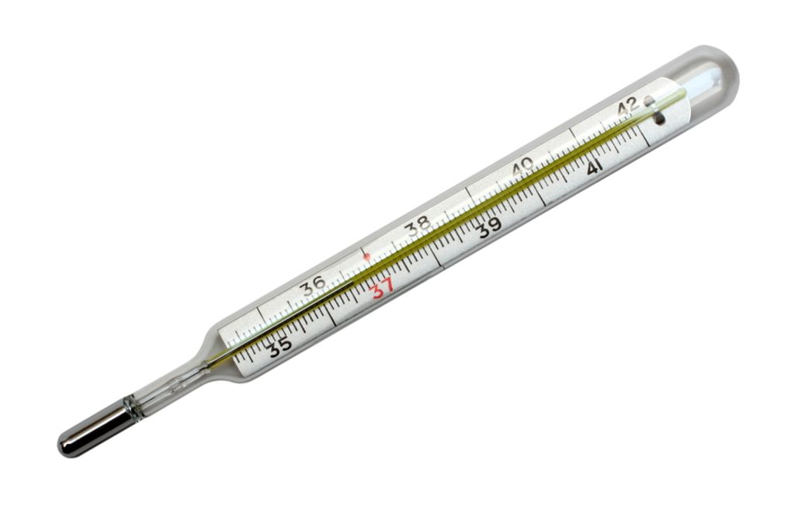

# O que são circuitos digitais?

Antes de falar sobre circuito digital, é necessário voltar um passo atrás e enteder o que é a **representação digital** e a diferença entre a **representação analógica**. Ambos são formas de representar dados, pórem suas características são diferentes. Um exemplo de aparelho que utilizia a representação análogica, é o termômetro de mercúrio, como este:



Neste aparelho, a representação da temperatura está relacionada diretamente com o materia dentro do termômetro, assim, qualquer variação nesse material, há uma variação na representação da temperatura, além disso, não se consegue dizer com precisão exata o valor da temperatura, pois há sempre pequenas variações, diz se que esse valor é um dado contínuo. Em geral, essas são as características básicas da representação analógica, um dispositívo mecânico que possue um dado contínuo. 

Já na representação digital, não é trabalhado com dados contínuos, e sim, por representações discretas. Ou seja, com dados que possue um determinado número de digitos fixos, que podemos identificar com precisão o seu valor. Por exemplo, em termomêtros digitais é mostrado dois digitos fixos para representar a temperatura, por exemplo 37°, ou seja, conseguimos ver exatamente a temperatura atual, sem nem uma ocilação relacionada a dispositivos mecânicos.

Para representar os dados de forma digital, é utilizado o **sistema binário**. Enquanto no sistema númerico que conhecemos, o decimal, há 10 simbolos, os digitos de 0 a 9, no sistema binário há somente dois simbolos, 0 e 1. Apesar do sistema binário perecer diferente do que conhecemos, ele é muito semelhante, podemos somas seus números, subtrair e contar. Por exemplo, se formos contar de 0 a 5 e binário, seria dessa forma:

Decimal | Binário
--------|--------
0 | 0
1 | 1
2 | 10
3 | 11
4 | 100
5 | 101
... | ...

Com isso podemos dizer o que é um são circuitos digitais, eles são aparelhos que utilizam a representação digital, juntamente com o sistema binário em seus vários dipositivos. 

No geral, os circuitos digitais possuem entradas de dados, e formas de saida que dependem dessas entradas. Por exemplo, pense em um circuito que possue três chaves e uma luz, nesse circuito, ao pressionar as três chaves a luz acende. Ao analisar, temos que as chaves são as entradas, e o estado da luz(acesso/apagado) é a saida. Já a forma como o circuito opera, é chamada de **lógica** do circuito. Por exemplo, podemos alterar a lógica desse circuito para ele acender a luz apenas quando uma chave estiver ligada.

# Portas logicas

Para criar a lógica de como um circuito digital funciona, um dos componentes básicos e fundamentais, são as portas lógicas. Portas lógicas são essenciais em qualquer circuito, até mesmo nos computadores mais avançados, seus componentes básicos, como o processador, é formado por muitas e muitas portas lógicas.

Para descrever portas lógicas e outros componentes, pode-se utilizar a a ideia de tabelas-verdade. Que é uma tabela que mostra os possiveis valores para as entradas de um componente e as suas possiveis saídas. Por exemplo, o circuito que acende uma lâmpada quando três chaves estão ligadas pode ser descrito dessa forma:

Entrada 1 | Entradas 2 | Entrada 3 | Saida
----------|------------|-----------|------
0 | 0 | 0 | 0
0 | 0 | 1 | 0
0 | 1 | 0 | 0
0 | 1 | 1 | 0
1 | 0 | 0 | 0 
1 | 1 | 0 | 0
1 | 1 | 1 | 1

Nas tabelas e nos circuitos, é dito que quando temos o valor 1, aquela entrada/saida está ligada. Quando temos o valor 0, a entrada/sainda está desligada. Portanto na tabela acima, temos que a saida do circuito está ligada apenas quando todas as três entradas estão fechadas.

Iremos ver ao longo desse post e dos próximos, algumas das portas lógicas essenciais para se contruir circuitos, suas tabelas verdade, e também circuitos básicos implementados em minecraft.

## Porta `AND`

O funcionamento da porta lógica `AND` ou `E`(em português) é usado no nosso cotidiano de forma despercebida, sempre usamos `e` para expressar que faremos algo quando dois eventos acontecem, por exemplo: Vou a praia se não chover **e** não estiver frio. A porta lógica `AND` funciona da mesma forma, ou seja, sua saida é ligada somente quando todas as suas entradas estão ligadas também. Ou seja, a tabela verdade que vimos anteriormente é equivalente a tabela do `AND`. A quantidade de entradas pode ser escolhida dependendo do problema, anteriormente vimos um `AND` com três entradas, mas no geral, é escrito com duas. Dessa forma: 

Entrada 1 | Entradas 2 | Saida
----------|------------|------
0 | 0 | 0
0 | 1 | 0
1 | 0 | 0
1 | 1 | 1

Em diagramas de circuito, a porta lógica `AND` é desenhada dessa forma:


Em minecraft, podemos criar um AND dessa forma:


Nesse caso, somente quando as duas alavanças então ligadas a lâmpada acende. Não é necessario se preocupar nesse momento como esse blocos aparentemente aleatórios formam um `AND`, o leitor precisa apenas entender o funcionamento da saida.

## Porta `OR`

A porta `OR` tem resultado ligado quando ao menos uma das suas entradas estiver ligadas. Pode-se utilizar quantas portas forem necessárias para o circuito, mas no geral, utiliza-se a versão padrão, com duas portas. Esta versão é descrita dessa forma:

Entrada 1 | Entradas 2 | Saida
----------|------------|------
0 | 0 | 0
0 | 1 | 1
1 | 0 | 1
1 | 1 | 1

A representação gráfica dessa porta, é geralmente definida da seguinte forma:


Em minecraft, podemos criar um OR dessa forma:


Onde, a lâmpada é ligada quando qualquer uma das alavancas forem ligadas.

## Porta `NOT`

A porta `NOR`, também conhecida como inversor, possue apenas uma entrada e uma saida, a saida é o inverso da entrada. Dessa forma:

Entradas | Saida
---------|------
0 | 1
1 | 0

Sua representação gráfica é:


Em minecraft, esta porta é simples:


# Representação Algêbrica

Para representar circuitos de forma simples e para facilitar a estudos de simplificação de circuitos, desenvolveu-se uma forma de representar as portas lógicas de forma matemática.

Nessa notação, um `AND` é representado por o sinal de multiplicação. Assim:

```
X = A*B
```

Isto quer dizer que a saida, que é chamada de `X` é definida como a porta `AND` com as entradas `A` `B`. Isto é equivalente a:


Já o `OR` é escrito com o simbolo de soma, assim:

```
X = A+B
```

Isto é equivalente a um circuito formado por duas entradas `A` e `B` que alimantam um `OR `e sua saida `X`.

A porta `NOT` é escrita como sua entrada com uma barra em cima. Por exemplo, o circuito onde temos duas entradas conectadas em um OR e a saida conectada em um `NOT` é descrito na forma gráfica e matemática a seguir:


Perceba que em ambos as formas, é possivel conectar os componentes de forma que a saida de uma porta é usada como entrada para outro componente. Com essa ideia, é possivel criar circuitos complexos, da forma que se desejar.

# Links:

 - O próximos post é: []()
 - O post anterior a este é: []()
 - Seção com todos os artigos: [sumário](../)

