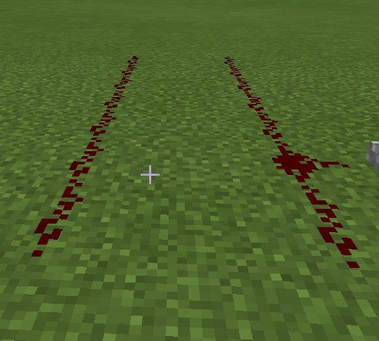
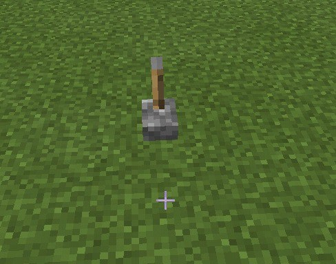
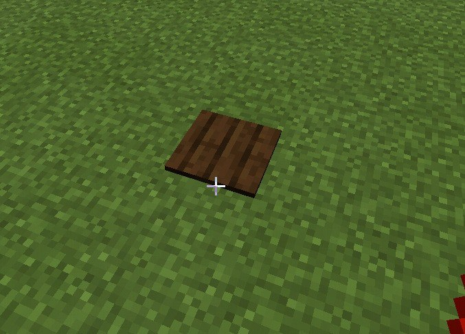
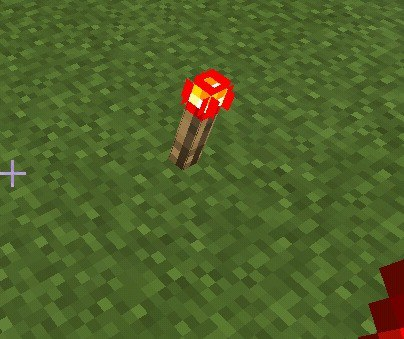
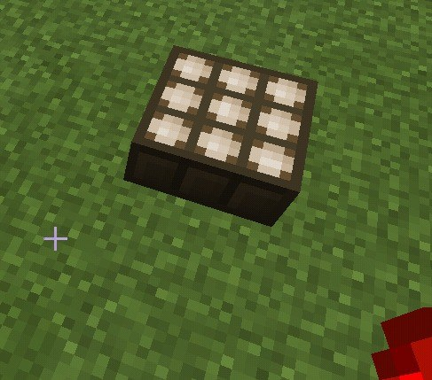
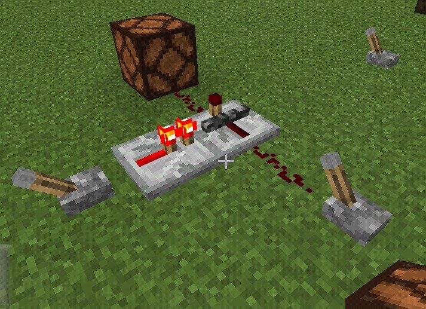
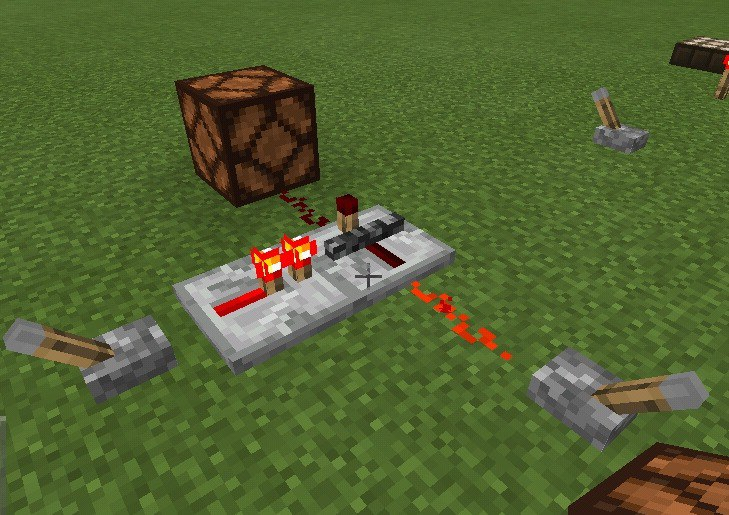
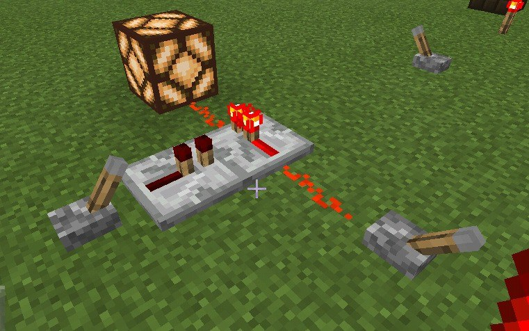

# Minecraft e os Circuitos de Redstone

Minecraft é um videogame de construção sandbox e de mundo aberto, onde os jogadores têm a 
possibilidade de criar e compartilhar diferentes mundos que dispõem de um ambiente tridimensional totalmente
modificável feito de blocos de uma unidade cúbica. Os mundos no Minecraft são baseados na 
vida real, possuindo conceitos como o ciclo do dia e noite, gravidade (exceto nos blocos) e 
energia.

O ambiente do jogo oferece recursos que podem ser utilizados para a execução de atividades 
como a caça, mineração, construção de estruturas e a fabricação de itens e ferramentas. Dentre os 
recursos, um dos mais utilizados no jogo são os circuitos de redstone que basea-se nos circuitos 
elétricos da vida real, possuindo noções de transmissão de energia e elementos que auxiliam no 
funcionamento dos circuitos.

Semelhante aos circuitos elétricos, os circuitos de redstone tem a finalidade de controlar 
mecanismos e automatizar tarefas do contidiano do jogador, através da interação de energia com 
determinados itens e blocos. Possui esse nome devido ao seu principal meio de transmissão de energia: 
o pó de redstone, que é um minério que pode ser coletado através da mineração.

# Energia no Minecraft

 A energia no Minecraft funciona de modo semelhante à energia do mundo real. 
Ela pode ser transmitida de ponto a ponto e possibilita a mudança de estado de 
determinados objetos dentro do jogo, como portas, lâmpadas e elementos dos circuitos 
de redstone.

## Transmissão de Energia

 Como dito anteriormente, a energia no Minecraft propraga-se, principalmente, 
através do pó de redstone, que precisa ser colocado em cima dos blocos e estar 
ligado uns com os outros para que ocorra a transmissão de energia. Essas ligações são
popularmente chamadas de fios de redstone devido a sua semelhança com os fios elétricos
(ver imagem abaixo).

Outra forma de transmitir energia é através de alguns blocos específicos, como 
o bloco de pedra e seus derivados. Eles são energizados através do contato com os fios 
de redstone energizados, que por sua vez, precisam estar ligados a alguma fonte de energia. 
Observação: quando se trata de blocos, a energia não é transmitida de bloco para bloco e 
nem de bloco para pó de restone, apenas de pó de redstone para bloco e de bloco para repetidor 
(será visto posteriormente).

## Fontes de Energia   

  As fontes de energia, como o próprio nome já diz, são responsáveis por gerar energia. 
 A seguir, podemos ver algumas das principais fontes de energia e suas características.

## Alavanca

 As alavancas são umas das fontes de energia mais utilizadas pelos jogadores novatos 
devido a sua simplicidade e praticidade. Ela possui dois estados: para cima (desligado) e 
para baixo (ligado), que podem ser mudados apenas pela interação direta dos jogadores. 
Ou seja, ela irá gerar energia contínua somente quando um jogador abaixa-la diretamente. 
Se estiver levantada, não gerará energia nenhuma. 

### Placa de Pressão

 As placas de pressão também são bastante utilizadas pelos jogadores novatos. Elas 
são inseridas no chão e são pressionadas enquanto alguma entidade (jogadores, animais, 
monstros ou itens que possui movimentação) estiver sobre ela. As placas de pressão também 
possuem dois estados: quando está sendo pressionada (ligado) e quando não está sendo 
pressionada (desligada). Ela só gerará energia se, e somente se, alguma entidade estiver 
sobre ela. Caso contrário, não gerará energia alguma.

### Tocha de Redstone

As tochas de redstone são uma fonte de energia um pouco diferente das que vimos 
até agora. Elas também possuem dois estados: acesa (gera energia) e apagada 
(não gera energia), com a diferença que o seu estado inicial é “acesa”, gerando 
energia contínua. Para apagar a tocha de redstone é preciso, exclusivamente, que 
ela esteja em contato direto com um bloco energizado.    

   

### Painel Solar

O painel solar é uma fonte de energia um pouco mais complexa. Ela possui 2 estados (ligado e desligado) que são mudados de acordo
com o período atual do dia. Além disso, ela possui 2 modos: Diurno e Noturno. Quando 
está no modo Diurno, ela gera energia contínua enquanto estiver de dia, deixando de 
gerar quando chega a noite. Já no modo Noturno, acontece o contrário: ela gerará energia
contínua enquanto estiver de noite, deixando de gerar quando estiver de dia. 
Observação: para exercer sua função, ela não pode estar sob nenhum bloco, ou seja, 
precisa estar ligada diretamente com o céu.      
       

          
## Potência de energia  
     
Ademais, os fios de redstone possuem a ideia de nível de potência de energia. 
Ao energizar os fios de redstone, a energia é propragada por, no máximo, 15 unidades 
de distância (blocos) a partir da fonte de energia, e em cada bloco o nível da potência 
de energia é diferente. Por exemplo, se energizarmos um fio de redstone de 15 blocos, 
o primeiro bloco possui o nível de potência de energia máximo, enquanto o último bloco 
possui nível de potência de energia mínimo.

Dando continuidade ao exemplo anterior, se colocarmos pó de redstone em mais um 
bloco, a energia será anulada, o que pode ser um problema a depender do tamanho do circuito. 
Felizmente, o Minecraft disponibiliza um item que prolonga essa carga chamada de repetidor, 
que será vista com mais detalhes a seguir.

### Repetidor

O repetidor é um elemento indipensável em circuitos de redstone maiores. Ele é responsável
por prolongar a carga por mais 15 unidades de distância (blocos) dos fios de redstone.
Para facilitar o entendimento, podemos pensar no repetidor como uma extensão que 
estende energia nos fios de redstone. Além de estender, eles são utilizados para 
impedir a junção indesejada de fios de redstone, e também para transmitir a energia de 
blocos energizados, conforme dito anteriormente. 

Uma característica importante do repetidor é o bloqueio de energia. Um repetidor de 
redstone pode ser "bloqueado" por outro repetidor de redstone energizado de frente
para o seu lado. Quando bloqueado, o repetidor não altera sua saída (seja alimentado
ou não), não importa o que a entrada faça. Quando o repetidor lateral desliga
novamente, o repetidor retorna ao seu comportamento normal (ver imagens abaixo). 

 

