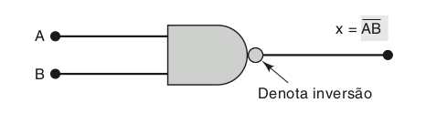

# Portas `NAND` e `NOR`

Além das três portas básicas que vimos no artigo anterior, é possivel combinála-las para criar outras duas portas, são elas `NAND` e `NOR`. Essas duas são muito importantes na construção de dispositivos de circuito integrado(CI) e são conhecidos como portas universais, o motivo será visto no final do post.

## Porta `NAND`

A porta lógica `NAND` pode ser construida como a porta `AND` com sua saida conectada a uma porta `NOT`, por isso é conhecida como `NOT-AND`. A tabela-verdade dessa porta pode ser descrita dessa forma:

Entrada 1 | Entradas 2 | Saida
----------|------------|------
0 | 0 | 1
0 | 1 | 1
1 | 0 | 1
1 | 1 | 0

A representação gráfica dessa porta, é geralmente definida da seguinte forma:

Veja na imagem, que a representação é semelhante a uma porta `AND`, porém no fim da parta há um pequeno circulo que representa a inversão do `AND`. Veja também que na imagem a cima também é mostrado como é descrito essa porta na representação algébrica.

Em minecraft, podemos criar um `NAND` dessa forma:

Foi criado apenas combinando os circuitos do `AND` e `NOT`.

## Porta `NOR`

Assim como o `NAND` é definido como a composição do `AND` e `NOT`. O `NOR` é definido como a composição do `OR` e o `NOT`. Ou seja, temos duas entradas para a porta `OR` e sua saida é conectada a um `NOT`. Portanto, a tabela-verdade para essa porta é:

Entrada 1 | Entradas 2 | Saida
----------|------------|------
0 | 0 | 1
0 | 1 | 0
1 | 0 | 0
1 | 1 | 0

A representação gráfica dessa porta juntamente com sua representação algébrica, é geralmente definida da seguinte forma:

Em minecraft, podemos criar um `NOR` dessa forma:

Assim como o `NAND`, o `NOR` foi criado combinando o circuito do `OR` e do `NOT` que vimos anteriormente.

# Universalidade das portas `NAND` e `NOR`

Como foi dito anteriormente, ambas as portas `NAND` e `NOR` são conhecidas como portas universais. Elas possuem essas característica porque ao utilizar combinações da porta `NOR` é possível implementar todas as outras portas.

Da mesma forma, é possivel implementar todas as outras portas utilizando apenas combinações de `NAND`, veja um exemplo de implementação de três portas utilizando o `NAND`:

Estas portas do exemplo também podem ser implementadas utilizando combinações de portas `NOR`.

Com esses primeiros posts vimos as portas básicas, nos próximos iremos ver como criar circuitos mais complexos utilizando esses conhecimentos.

# Links:

 - O próximos post é: 
 - O post anterior a este é: 
 - Seção com todos os artigos: [sumário](../)

