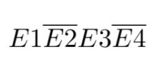

# Descrição do Projeto em Minecraft

O projeto desse artigo consiste em automatizar um processo simples do contidiano dos jogadores de Minecraft: entrar e sair de uma casa com a porta trancada por senha. Se fossemos realizar esse processo manualmente no Minecraft, o fluxo de procedimentos seria:

- Destrancar a porta, atráves de uma sequência de alavancas específicas;
- Abrir a porta, mudando diretamente seu estado de "Fechado" para "Aberto;
- Entrar na casa;
- Fechar a porta, mundando diretamente seu estado de "Aberto" para "Fechado";
- Verificar se está de noite ou de dia, atráves da ausência ou presença de iluminação provida do sol;
- Se estiver de noite, acender a lâmpada manualmente através de uma alavanca.

Para sair de uma casa no Minecraft, o processo seria o contrário:

- Se lâmpada estiver acesa, apaga-la atráves de uma alavanca;
- Abrir a porta, mudando diretamente seu estado de "Fechado" para "Aberto;
- Sair da casa;
- Fechar a porta, mudando diretamente seu estado de "Aberto" para "Fechado";
- Trancar a porta.

Todos esse processos podem ser automatizados atráves do circuitos de redstone, que podem ser formulados atráves dos circuitos digitais. A seguir, veremos todos os componentes lógicos para formular o circuito.

# Descrição dos Componentes Lógicos

Como foi visto, para formulação do circuito digital, primeiramente precisamos pensar no problema em que queremos resolver. Para melhorar o entendimento do circuito, dividiremo-os em 2 circuitos menores: o que diz respeito a porta, e o da lâmpada. Começaremos com circuito de destrancar e abrir a porta a seguir.

## Circuito da Porta

Primeiramente, precisamos detalhar todo os processos condizentes com a porta. O processo será o seguinte: Existirá uma sequência de 4 alavancas (entradas 1, 2, 3, e 4), uma placa de pressão (entrada P), e uma a porta (saída S). Ao pressionar a placa, a porta abrirá somente se: a primeira alavanca estiver ligada; a segunda estiver desligada; a terceira estiver ligada, e a quarta desligada. No caso, a senha seria 1010, onde cada algorismo representa a sua respectiva alavanca da esquerda para a direita.

Traduzindo para o contexto de circuitos digitais, isso significa que o circuito terá dois AND: o primeiro com as entradas E1, E2, E3, E4 (alavancas) e a saída T; e o segundo terá, como entradas, a saída T e a P (placa), e, como saída, o S (porta). A tabela verdade desse circuito seria:

##### Primeiro `AND`
Linha | Entrada 1 | Entradas 2 | Entrada 3 | Entrada 4 | Saída T
----------|----------|------------|-----------|-----------|------
1 | 0 | 0 | 0 | 0 | 0
2 | 0 | 0 | 0 | 1 | 0
3 | 0 | 0 | 1 | 0 | 0
4 | 0 | 0 | 1 | 1 | 0
5 | 0 | 1 | 0 | 0 | 0
6 | 0 | 1 | 0 | 1 | 0
7 | 0 | 1 | 1 | 0 | 0
8 | 0 | 1 | 1 | 1 | 0
9 | 1 | 0 | 0 | 0 | 0 
10 | 1 | 0 | 0 | 1 | 0 
11 | 1 | 0 | 1 | 0 | 1
12 | 1 | 0 | 1 | 1 | 0
13 | 1 | 1 | 0 | 0 | 0
14 | 1 | 1 | 0 | 1 | 0
15 | 1 | 1 | 1 | 0 | 0
16 | 1 | 1 | 1 | 1 | 0

Como podemos perceber, apenas as entradas da linha 22 fará com que a saída seja positiva. A expressão booleana da linha 22 é

Como dito, o segundo `AND` teria a saída T e a entrada P como entradas. Isso significa que, ao pisar na placa (entrada fica positiva), a porta só irá abrir se a saída T for positiva, ou seja, so irá abrir se a senha for colocada corretamente. Portanto, o circuito referente à porta ficará da seguinte forma:

Agora que temos o circuito, basta apenas passarmos para circuito de redstone do Minecraft. O circuito de Redstone da porta ficará da seguinte forma:

