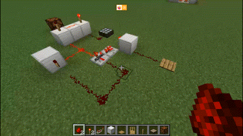

# Descrição do Projeto em Minecraft

O projeto desse artigo consiste em automatizar um processo simples do contidiano dos jogadores de Minecraft: entrar e sair de uma casa com a porta trancada por senha. Se fossemos realizar esse processo manualmente no Minecraft, o fluxo de procedimentos seria:

- Destrancar a porta, atráves de uma sequência de alavancas específicas;
- Abrir a porta, mudando diretamente seu estado de "Fechado" para "Aberto;
- Entrar na casa;
- Fechar a porta, mundando diretamente seu estado de "Aberto" para "Fechado";
- Verificar se está de noite ou de dia, atráves da ausência ou presença de iluminação provida do sol;
- Se estiver de noite, acender a lâmpada manualmente através de uma alavanca.

Para sair de uma casa no Minecraft, o processo seria o contrário:

- Se lâmpada estiver acesa, apaga-la atráves de uma alavanca;
- Abrir a porta, mudando diretamente seu estado de "Fechado" para "Aberto;
- Sair da casa;
- Fechar a porta, mudando diretamente seu estado de "Aberto" para "Fechado";
- Trancar a porta.

Todos esse processos podem ser automatizados atráves do circuitos de redstone, que podem ser formulados atráves dos circuitos digitais. A seguir, veremos todos os componentes lógicos para formular o circuito.

# Descrição dos Componentes Lógicos

Como foi visto, para formulação do circuito digital, primeiramente precisamos pensar no problema em que queremos resolver. Para melhorar o entendimento do circuito, dividiremos em 2 circuitos menores: o que diz respeito a abriar a porta utilizando senha, e o da lâmpada. A seguir, começaremos com circuito de abrir e fechar a porta.

## Circuito da Porta

Primeiramente, precisamos detalhar todo os processos condizentes com a porta. O processo será o seguinte: Existirá uma sequência de 4 alavancas (entradas 1, 2, 3, e 4), uma placa de pressão (entrada P), e uma a porta (saída S). A senha seria 1010. Portanto, ao pressionar a placa, a porta abrirá somente se: a primeira alavanca estiver ligada; a segunda estiver desligada; a terceira estiver ligada, e a quarta desligada.

> Definimos essa senha aleatoriamente, o leitor pode se sentir vontade para replicar o circuito com uma senha diferente.

Traduzindo para o contexto de circuitos digitais, teremos um circuito que tem resultado ligado quando a senha estiver correta, e um circuito formado pela placa de pressão, com isso, a porta abrirá quando ambos os circuitos estiverem ligados. A tabela verdade do circuito que indica se a senha está correta é:

Linha | Entrada 1 | Entradas 2 | Entrada 3 | Entrada 4 | Saída T
------|-----------|------------|-----------|-----------|--------
1 | 0 | 0 | 0 | 0 | 0
2 | 0 | 0 | 0 | 1 | 0
3 | 0 | 0 | 1 | 0 | 0
4 | 0 | 0 | 1 | 1 | 0
5 | 0 | 1 | 0 | 0 | 0
6 | 0 | 1 | 0 | 1 | 0
7 | 0 | 1 | 1 | 0 | 0
8 | 0 | 1 | 1 | 1 | 0
9 | 1 | 0 | 0 | 0 | 0 
10 | 1 | 0 | 0 | 1 | 0 
11 | 1 | 0 | 1 | 0 | 1
12 | 1 | 0 | 1 | 1 | 0
13 | 1 | 1 | 0 | 0 | 0
14 | 1 | 1 | 0 | 1 | 0
15 | 1 | 1 | 1 | 0 | 0
16 | 1 | 1 | 1 | 1 | 0

Como podemos perceber, apenas as entradas da linha 11 fará com que a saída seja positiva. Portanto, a expressão algebrica desa tabela é:

Agora iremos conectar esse circuito a cima com a placa de pressão, essa conexão será feita utilizando um `AND`, pois queremos que a porta abra quando a placa de pressão estiver ativa e, ao mesmo tempo, o circuito nos indique que a senha está correta. Isso é feito da seguinte forma: 

Agora que temos o circuito, basta apenas implementa-lo utilizando circuitos de Redstone do Minecraft. O resultado ficará da seguinte forma:

## Circuito da lâmpada

Agora veremos a segunda parte do circuito: o circuito da lâmpada. O processo de acender a lâmpada é o seguinte: quando o jogador entrar na casa, vai depara-se com uma outra placa de pressão (entrada Y) que será responsável por acender a lâmpada (saída L), que por sua vez so irá acender se, no momento em que o jogador pisar na placa, estiver de noite. Para isso, será necessário um sensor que identifica ausencia de luz solar, ou seja, durante o dia essa entrada estará em 0, e a noite estará ativa. No Minecraft, tal entrada seria a ferramenta Painel Solar no modo Noturno.

Além disso, a lâmpada deve apagar, caso o jogador pise novamente na placa para sair da casa. Ou seja, precisamos de um dispositivo que alterne seu estado sempre que houver um pulso proveniente da placa. Podemos fazer o uso de um Flip-Flop D com o ~Q sendo a entrada D e a placa de pressão como o clock, nos permitindo alternar o estado da saída L (lâmpada) toda vez que pisarmos na placa (ver imagem abaixo).

Dito isso, a lâmpada só irá acender caso o Flip-Flop esteja ativo (indica que a pessoa está dentro da casa) e quando a placa solar está ativa(indica que está de noite). Para isso, é preciso adicionar uma porta `AND` que conecte o Flip-Flop e o painel solar, o resultado dessa porta `AND` será conectado na lâmpada. O resultado é o seguinte:

No minecraft, o circuito de Redstone correspondente seria:

# Circuito de Redstone Completo

Com o circuito da porta e o da lâmpada já formulados, precisamos efetuar a integração dos circuitos. Para isso precisamos traçar o que os dois circuitos tem em comum. Na descrição do projeto, a placa de pressão interna à casa, além de acender a lâmpada, também abre a porta. Como ambas as placas abrem a porta, isso significa que qualquer uma das duas que forem pressionadas e estiverem de acordo com os seus critérios, a porta deverá abrir.

No contexto de circuitos, precisaremos utilizar a porta lógica `OR` que tem como entradas a saída do circuito da porta (saída P) e a placa de pressão interna (entrada Y). Então, o circuito completo do projeto ficará da seguinte forma:

No minecraft, o circuito de Redstone correspondende é:

 

# Projeto Completo no Minecraft

A seguir, iremos disponibilizar o link para download do Projeto funcionando dentro do Minecraft. Para você utilizar o mundo é necessário baixar o arquivo `.zip`, extrair o arquivo zipado. Após isso, com o Minecraft já instalado, copie a pasta extraída e cole na pasta `.minecraft/saves` no seu computador. Pronto, entre no jogo e estará o mundo salvo para você utilizar!
